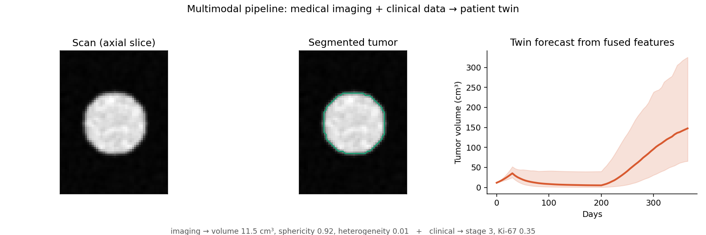
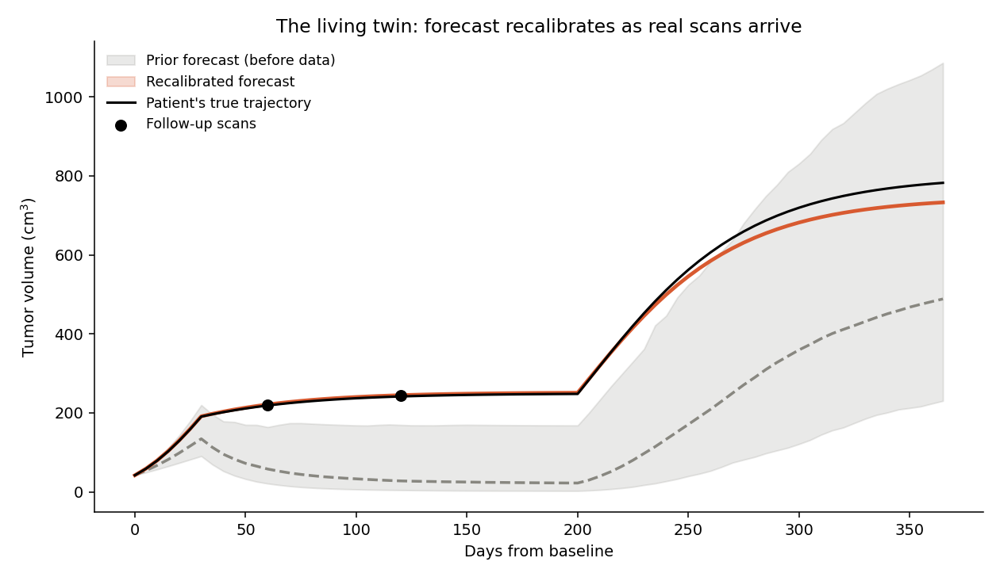
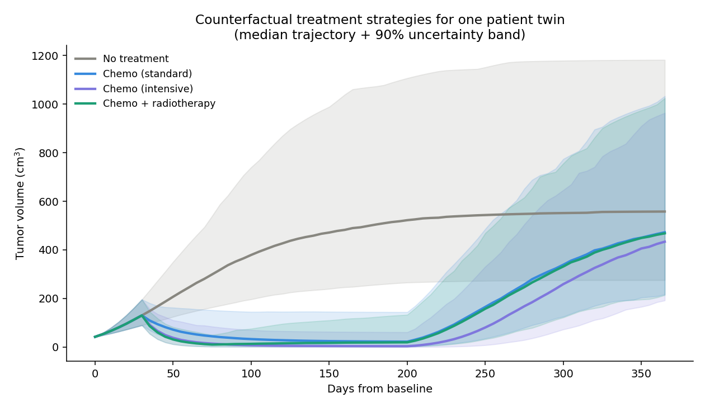
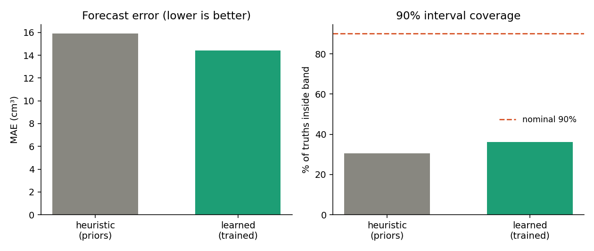

# OncoTwin

**A living, probabilistic cancer patient digital twin for oncology decision support.**

Unlike a static predictor that outputs one number, OncoTwin keeps a *belief*
about a patient's tumor that recalibrates as new scans arrive, forecasts disease
as a distribution of trajectories with honest uncertainty, and simulates
counterfactual treatment strategies in silico.

> [!WARNING]
> **Research and educational software — not a medical device.** Parameters are
> interpretable clinical priors, not trained on patient data, so specific numbers
> are illustrative. Nothing here is validated for clinical use.

---

## Multimodal: imaging + clinical data

The pipeline turns an actual scan into twin inputs and fuses them with clinical
data — the multimodal core of the project:

```
load scan → segment tumor → extract radiomics → fuse(+ clinical) → patient twin
```



Imaging contributes the segmented tumor volume and texture-based heterogeneity;
clinical/molecular data contributes stage, age, and markers. Runs on a phantom
scan out of the box (`make imaging-demo`) and on real `.npy` / NIfTI (TCIA,
BraTS) via `load_volume`. The threshold segmenter is a transparent baseline —
swap a trained model behind the same interface.

## What makes it a *twin*, not a predictor

1. **Living state.** New measurements recalibrate the twin's parameters via
   Bayesian data assimilation (a particle filter) — the same principle weather
   models use to stay locked onto reality.
2. **Probabilistic.** Forecasts are trajectory *distributions* with 90% bands,
   not point estimates.
3. **Counterfactual.** A hybrid model — an ML layer estimating patient-specific
   parameters that feed a mechanistic Gompertz-with-treatment growth model — lets
   you compare therapy options.
4. **Interpretable.** Every parameter is biologically meaningful; the twin reports
   its current belief in plain terms.

### The living twin, recalibrating on real scans



The prior forecast (grey) expected a good response and a plateau. The patient's
true trajectory (black) kept climbing. After two follow-up scans, the twin's
forecast (coral) corrected upward and locked onto reality.

### Counterfactual treatment strategies



One patient, four strategies, each a probabilistic trajectory. Therapy bends the
curve during the treatment window; the tumor regrows after it stops.

---

## Results & analysis

Train the parameter estimator and evaluate it end-to-end:

```bash
make analysis        # -> analysis/RESULTS.md + figures
```

This trains on a synthetic cohort, backtests the heuristic vs the trained
estimator (assimilate 2 scans, forecast the rest), and reports forecast error,
90%-interval coverage, and a PIT calibration diagnostic.



Training improves accuracy and calibration, but the analysis is honest about the
current limitation: **both estimators are still overconfident** — with only two
scans the particle filter concentrates the ensemble and the forecast omits
process noise, so the bands are too tight. The fixes are tracked in the roadmap.
Full write-up: [analysis/RESULTS.md](analysis/RESULTS.md).

## Quickstart

```bash
pip install -e ".[dev]"      # install
make test                    # run the test suite
make demo                    # generate the figures above
make backtest                # validate forecast calibration on a synthetic cohort
```

Run the full app (API + 3D web UI):

```bash
make serve
# API  → http://localhost:8000  (interactive docs at /docs)
# Web  → http://localhost:8080
```

The web UI calls the API when it is running and falls back to an in-browser copy
of the engine otherwise, so `web/index.html` also works opened directly.

---

## Using the engine

```python
from oncotwin import OncoTwinEngine, PatientFeatures, TreatmentPlan, TreatmentCourse, TreatmentKind, TumorMeasurement

engine = OncoTwinEngine()
twin = engine.create_twin("PT-0001", PatientFeatures(age=63, stage=3,
    histology="adenocarcinoma", baseline_volume_cm3=42.0, ki67=0.35))

chemo = TreatmentPlan("chemo", [TreatmentCourse(TreatmentKind.CHEMO, 30, 200, 1.0)])
f = engine.forecast(twin, chemo, horizon_days=365)
print(f.summary(horizon_day=365))          # median + 90% interval at 1 year

# recalibrate on a follow-up scan
engine.assimilate(twin, [TumorMeasurement(60, 120.0)])
print(engine.explain(twin))                # updated belief, bumped version
```

## API

| Method | Path | Purpose |
|---|---|---|
| `GET`  | `/health` | liveness |
| `POST` | `/twins` | create a twin from features |
| `GET`  | `/twins/{id}` | current belief |
| `POST` | `/twins/{id}/forecast` | forecast one plan |
| `POST` | `/twins/{id}/counterfactuals` | forecast several plans |
| `POST` | `/twins/{id}/measurements` | assimilate scans, recalibrate |

## Project layout

```
src/oncotwin/      engine (domain, growth, parameters, forecast, assimilation, engine)
                   store, validation, data/ (cohort adapters), api/ (FastAPI)
web/               3D twin UI (Three.js), API-backed with offline fallback
tests/             pytest suite (engine + API)
examples/demo.py   end-to-end demo that produces the figures
docs/              ARCHITECTURE.md, ROADMAP.md
```

See [docs/ARCHITECTURE.md](docs/ARCHITECTURE.md) for the design and
[docs/ROADMAP.md](docs/ROADMAP.md) for what's next — including the honest
calibration gap the validation harness already exposes.

## License

MIT — see [LICENSE](LICENSE).
