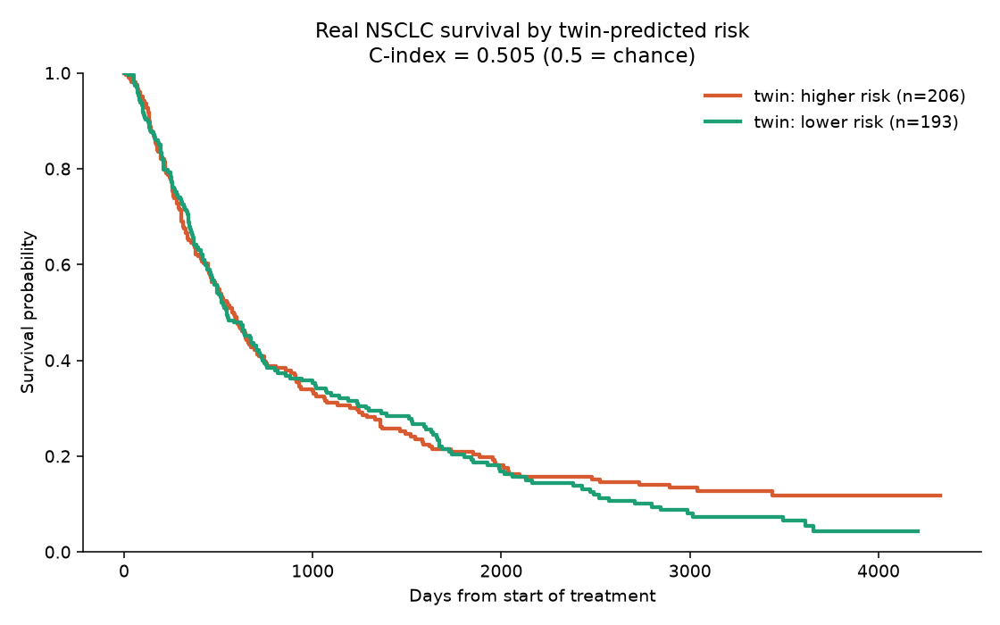

# Real-data validation (NSCLC-Radiomics / Lung1)

Source: TCIA NSCLC-Radiomics clinical data — 399 real NSCLC patients. For each
patient the twin is built from real age, stage, and histology; its implied tumor
growth rate is used as a risk score and compared to real survival.

- **Concordance index: 0.505** (0.5 = chance). At this value, the twin's
  biology-based risk does **not** predict real survival better than chance.
- **Median survival** — twin high-risk group: 583 days; low-risk group: 543 days
  (essentially the same).

## Why this result — and why it still matters

This is an honest negative result, and an expected one:

- The growth model was **never trained on survival** — it uses hand-set
  biological priors, so there is no reason it would rank real survival.
- The **imaging features that carry the prognostic signal are not loaded yet**
  (tumor volume, heterogeneity use cohort defaults), so the twin's risk here is
  driven only by stage and age.

The landmark study on this exact dataset showed that radiomic features extracted
from the scans *do* predict survival — and those features live in imaging we
have not yet ingested per patient. So the signal exists; we are simply not using
the part of the data that contains it.

## What would move this number

1. Ingest the real CT scans with their expert tumor masks and extract radiomics
   across the cohort.
2. Train the estimator against survival directly (e.g. a Cox model) instead of
   synthetic growth parameters.

## Honest limitations

Tumor volume, Ki-67, and imaging heterogeneity use cohort defaults (no
per-patient imaging yet). This is a simple validation, not a trained survival
model. Reporting a chance-level result truthfully is the point: the twin has
**not** been shown to predict real survival, and this document says so.
