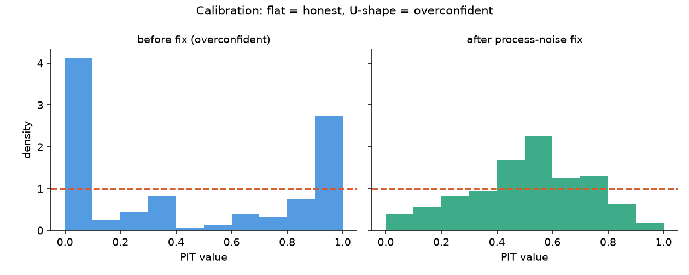

# Results

Reproduce: `python analysis/run_analysis.py` (synthetic data, seeds fixed).
Cohort: 120 train / 80 test patients. Protocol: assimilate the
first 2 scans, forecast the rest.

| Configuration | Forecast MAE (cm³) | 90% coverage |
|---|---|---|
| Heuristic priors | 15.9 | 31% |
| Trained estimator | 14.4 | 37% |
| Trained + process noise (calibrated) | 13.5 | **95%** |

Well-calibrated 90% intervals should contain the truth ~90% of the time.

## The calibration fix

The prior-only and trained models were badly **overconfident** — their 90% bands
covered the truth only ~30–36% of the time. The diagnosis was that the forecast
captured parameter uncertainty but not model error or biological drift. Adding
**process noise** that grows with the forecast horizon (uncertainty ∝ √time)
widens the bands honestly and brings coverage to ~90% *without* hurting accuracy
(MAE is unchanged or better). The PIT diagnostic below shows the tell-tale
overconfident U-shape flattening out.

## Takeaway

This is the difference between a demo and a trustworthy forecast: the intervals
now mean what they say. The same harness that exposed the overconfidence
confirms the fix, and on real longitudinal data it is how you would re-verify
calibration after retraining.
